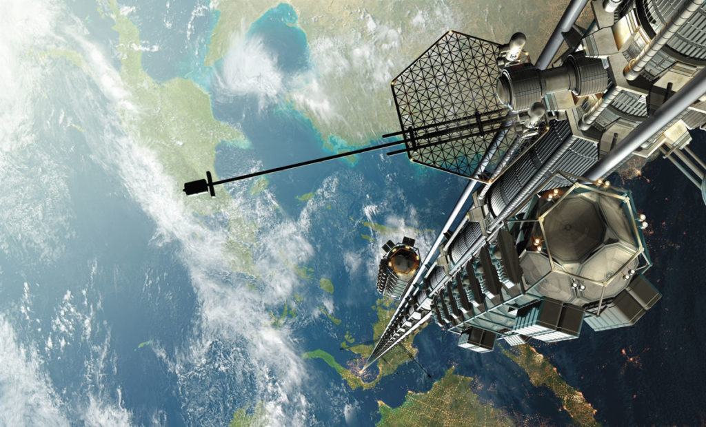
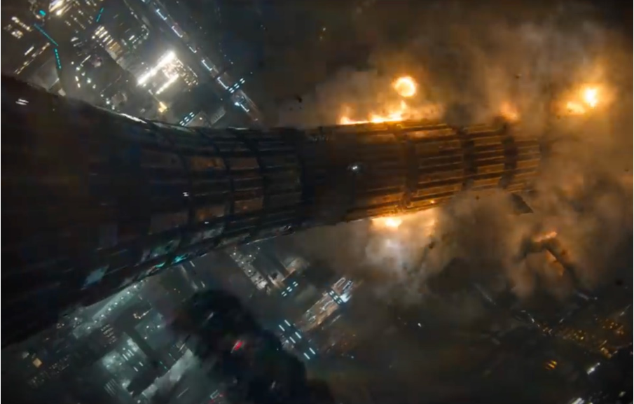

# **Задача: Космический лифт (40 баллов)**

*©Wikipedia / Автор: Lampronia Auxilius*

Концепция космического лифта так давно бегает по умам ученых и изобретателей, что стала уже классической. Научная фантастика, при этом, скорее портит ситуацию – с одной стороны, прививая широким массам нереалистичные ожидания, с другой – пугая зрелищными катастрофами.

*Кадр из сериала “Основание”, снятого по циклу романов Айзека Азимова.*

---

## **Условие задачи**

На геостационарную орбиту запускается станция, она соединяется тросом с наземной станцией, расположенной строго по вертикали на поверхности Земли. Данная архитектура обеспечивает возможность транспортировки полезной нагрузки и пассажиров без применения мощных двигательных установок и сложных ступенчатых систем запуска. Экономический эффект выражается в радикальном снижении стоимости выведения килограмма массы на орбиту, а также в упрощении габаритных ограничений полезной нагрузки.

Тем не менее, проект не реализуется на текущем этапе даже при наличии заинтересованных сторон и ресурсов (включая Илона Маска). С точки зрения экономического обоснования, ключевое препятствие заключается не столько в высокой капиталоёмкости строительства, сколько в сложности оценки и страхования рисков.

Например, как минимум в двух известных книгах *(“Основание” Айзека Азимова и “Красный Марс” Кима Стэнли Робинсона)* описан одинаковый сценарий катастрофы. Из-за разрушения станции на геостационарной орбите происходит обрыв троса, и он, оставшись без “держащей” его массы, начинает падать и “наматываться” на планету с возрастающей скоростью, “стирая все на своем пути”. В научных статьях при этом даются разные оценки для последствий такого сценария – от катастрофы до очень даже мирного исхода: “ниточка сгорит, не долетев до плотных слоев атмосферы”.

**Ваша задача** - предложить свой заход на данный вопрос: проанализировать, что произойдет при обрыве троса в верхней точке и произойдет ли в результате катастрофа.

---

## **Подробное описание задачи**

Разбейте эту *(вообще-то довольно масштабную)* задачу на несколько последовательных этапов. 

Для одних этапов будет достаточно ограничиться общефизическими оценками — например, прикинуть минимальную и максимальную возможную толщину троса. Для других этапов потребуется, в меру ваших сил и возможностей, провести численное моделирование.

Следует учитывать, что реальные полномасштабные эксперименты или данные расследований техногенных катастроф подобного рода у человечества отсутствуют*(пока)*. Тем не менее вы можете найти или предложить эксперименты меньшего масштаба, которые позволили бы проверить корректность ваших расчётов и оценок на отдельных этапах работы.

---

## **Критерии оценивания**

Это во многом творческая задача, поэтому оцениваться будет не только итоговое решение, но и то, как вы самостоятельно её сформулируете и разобьёте на этапы.

Максимальный балл (30) выставляется за чёткое структурирование постановки, наличие приблизительных оценок по всем выделенным этапам, а также результаты моделирования по одному из выбранных вами этапов. 

Оценка сверх максимального балла (40) может быть получена в случае, если вы сумеете верифицировать результаты моделирования с опорой на эксперимент (взятый из литературы либо понятный и легко воспроизводимый в обозримом будущем) либо если вам удастся выявить и учесть какой-либо аспект проблемы, не предусмотренный авторами задания.

