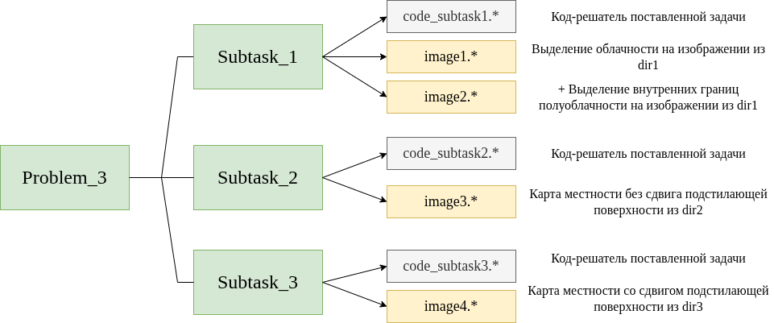

# **Задача: Карта местности под облаками (40 баллов)**
## **Условие задачи**

На серии аэрофотоснимков часть поля зрения занимают облака, мешающие составить представление о поверхности под ними. Облака перемещаются по кадру таким образом, что ни в какой момент времени невозможно увидеть всю поверхность целиком, но по нескольким кадрам возможно восстановить более полную картину("карту местности").

**Ваша задача** – собрать как можно более полное единое изображение по серии кадров, на каждом из которых закрыта часть полезной информации. Если серия кадров не позволяет восстановить изображение в какой-либо части карты (он остаётся закрытым на каждом кадре серии), то можно оставить этот участок белым.

На любом изображении гарантировано наличие полезной информации, то есть не всё изображение закрыто облаком. Предполагается, что подложка на серии кадров не претерпевает каких-либо искажений кроме, возможно, сдвигов в подзадаче 3.

Обратите внимание, что оцениваются не только идеально решённые подзадачи, но и их частичные решения, а также выбор подхода для решения. Подзадачи могут решаться в произвольном порядке. Если какие-то детали не указаны явно в условии задачи, то они остаются свободными для вашей интерпретации.

---

## **Подробное описание задачи**
### **Выделение области облачности на одном кадре**

Вам нужно создать 2 изображения:

1. Первое изображение должно отображать внешние границы облачных образований. Можно отобразить вместо границ бинарную маску облаков. Облако рассматривается как сплошной участок изображения, без отдельного рассмотрения полупрозрачных зон внутри облаков;

2. Второе изображение кроме внешних границ должно отображать внутренние приблизительные границы полупрозрачных областей внутри облака, которые можно использовать в дальнейшей обработке, несмотря на их частичное перекрытие облаком. Порог прозрачности облака можно выбрать как визуально, так и обосновать использование какого-либо статистического метода.

Для обработки задачи используйте изображение из папки [dir1](dir1/). **Ваш метод не должен быть заточен под конкретную фотографию и будет проверен организаторами на других подобных изображениях с облаками.** Наличие хотя бы одного облака на изображении гарантируется.

### **Создание неподвижной карты местности**

Вам нужно получить изображение местности по серии кадров. Для обработки своего решения используйте изображения из папки [dir2](dir2/).

На этих кадрах подстилающая поверхность не смещается, изменяется только положение и размер облаков. Несмотря на неподвижность поверхности, точное значение пикселей вне зон облаков на разных кадрах не идентично и может немного меняться от кадра к кадру. Размер у всех изображений одной серии одинаковый. **Ваш метод не должен быть заточен под конкретную серию фотографий и будет проверен организаторами на других подобных сериях изображений с облаками.**

### **Создание карты местности со сдвигом поверхности**

Аналогична предыдущей подзадаче, но теперь в серии изображений возможно смещение не только облаков, но и подстилающей поверхности. 

Для обработки решение можете использовать изображения из папки [dir3](dir3/).

Использование для создания карты не только чистых участков изображения без облаков, но и областей, просвечивающихся сквозь облако, будет плюсом, но решение будет считаться правильным и в случае рассмотрения облака как единого целого, без выделения информации из его полупрозрачных зон.

---

## **Формат выходных данных**

**1. Выделение облаков**

В данной подзадаче используйте изображение из папки [dir1](dir1/).

1) Должно выводиться изображение внешних границ облаков или бинарная маска участков с облачностью на изображении (без отдельного рассмотрения полупрозрачных зон внутри облаков).

2) Должно выводиться изображение внешних и внутренних границ областей облаков или бинарная/тернарная маска.

**2. Карта местности без сдвига подстилающей поверхности**

Должна выводиться карта местности, составленная по изображениям без сдвига подстилающей поверхности из папки [dir2](dir2/).

**3. Карта местности со сдвигом подстилающей поверхности**

Должна выводиться карта местности, составленная по изображениям со сдвигом подстилающей поверхности из папки [dir3](dir3/).

## **Определения**

*Бинарная маска изображения* - матрица таких же размеров, что и исходное изображение, где элементы со значением 1 соответствуют интересующим областям, а элементы 0 – фону.

*Тернарная маска изображения* - матрица таких же размеров, что и исходное изображение, где элементы со значением 1 соответствуют интересующим областям 1 типа (например, непрозрачная облачность), элементы со значением 2 соответствуют интересующим областям 2 типа (например, прозрачная облачность), а элементы 0 – фону. (для удобства отображения допустимо использовать три других значения).
