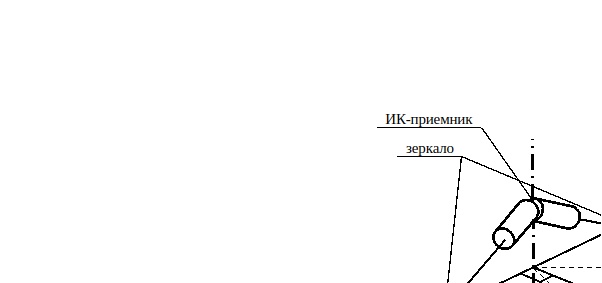

# **Задача: Алгоритм построения местной вертикали**

## **Условие задачи**

Датчик ИКВ 336К *(инфракрасной вертикали)* является частной реализацией **прибора ориентации на Землю (ПОЗ)**. Он пассивного типа – то есть регистрирует внешнее излучение. 

Сканирование пространства осуществляется двумя лучами в ИК-диапазоне. При переходе луча с видимого диска планеты на космическое пространство или обратно ИК-приемники прибора регистрируют изменение интенсивности теплового излучения, что позволяет сделать «засечку». Засечки интерпретируются как вектора в системе координат прибора, направленные на различные точки края видимого диска планеты. По этим векторам можно восстановить вектор на геометрический центр видимого диска планеты.

**Считая планету сферической**, данный вектор можно принять за **перпендикуляр к поверхности в текущей подспутниковой точке**, то есть за местную вертикаль.

На рисунке 1 представлена схема движения сканирующих лучей прибора ИКВ 336К.

**Ваша задача** - разработать и верифицировать алгоритм построения местной вертикали к поверхности Земли по данным от датчика ИКВ 336К.

---

## **Подробное описание задачи**

Прибор имеет два неподвижных ИК-приемника, а сканирование пространства осуществляется через зеркала, которые качаются на общей оси на угол $$\phi = 168^o$$, то есть на $$\pm 84^o$$ от нулевого положения. Расположение ИК-приемников относительно зеркал такое, что принимаемый от источника излучения ИК-луч наклонен на угол $$\theta = 52^o$$ относительно плоскости оси вращения зеркал.

Когда сканирующий луч пересекает горизонт, в приборе делается засечка – фиксируется значение угла $$\phi$$ для каждого луча. Таким образом за один цикл качания лучей возможно сделать до 4-х засечек, то есть до 4-х значений угла $$\phi$$. Однако, очевидно, возможны ситуации и с меньшим количество измерительных чисел.

Если при движении сканирующего луча сделать засечку не удалось, то в качестве значения угла возвращается его максимально возможное значение, т.е. $$84^o$$ (или $$-84^o$$).

В таблице приведены значения измерительных чисел для некоторых случаев ориентации аппарата относительно Земли, полученных на программном комплексе моделирования СУДН. Эти данные следует использовать в качестве верификационных для отработки алгоритма.

### Таблица – Данные по измерительным числам прибора ИКВ 336К

| № Случая | №1        | №2        | №3        | №4        |
|----------|-----------|-----------|-----------|-----------|
| 1        | -52.6875  | 62.6875   | -73.250   | 83.250    |
| 2        | -57.7156  | 63.7156   | -72.9938  | 78.9938   |
| 3        | -48.8781  | 68.8781   | -67.4219  | -84.0     |
| 4        | -59.4125  | 49.4125   | 84.0      | 75.5094   |
| 5        | -37.3438  | 43.3438   | 84.0      | 84.0      |
| 6        | 30.750    | -84.0     | 82.60     | -84.0     |
| 7        | 30.1218   | -84.0     | 84.0      | -84.0     |

---

## Формат выходных данных

Решение задачи должно содержать:

1) Описание разработанного алгоритма;

2) Результаты верификации алгоритма на предоставленных данных: **значение вектора (орта) на Землю** в системе координат прибора и/или **значение углов тангажа и крена**.

*Примечание*. Считать орбиту круговой. Тогда **тангаж** – угол поворота относительно оси противоположно направленной с вектором угловой скорости орбитального движения, **крен** – угол поворота относительно оси сонаправленной с вектором линейной скорости орбитального движения.

3) Визуализация работы алгоритма.

4) Возможные выводы, наблюдения, заключения по результатам решения задачи.

